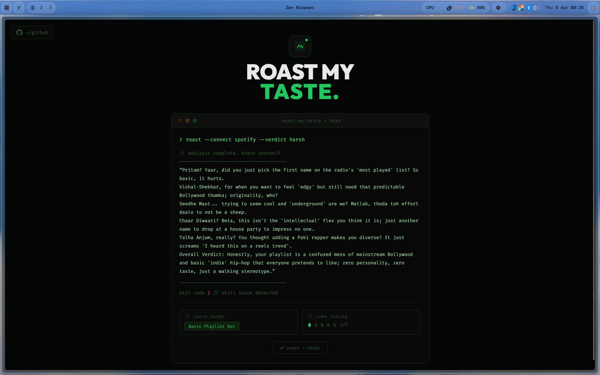

## roastify

roastify is a music taste roaster, this will basically take your spotify account and then roast your taste in music.

> [!NOTE]
> Spotify apps can only be made by organizations now, not by individuals
> So I can only access 5 users to use this site, as Dev mode only allows 5 users

Hosted here:

https://roastify-inky.vercel.app/

(if it shows an error, just retry a bit and just be a little patient)

### features

it will:
- roast your taste in music
- get a badge based on your taste
- get a rating for your taste (it won't be good i promise you that)

### working

for the nerds out there:

- backend is hosted on Render (it sleeps after 15 minutes of activity)
- frontend on vercel
- fronted is designed in next js and tailwind css
- backend is made with fastapi
- it uses the spotify api, to fetch your top 5 artists
- and uses Gemini api to roast you and give you a badge accordingly